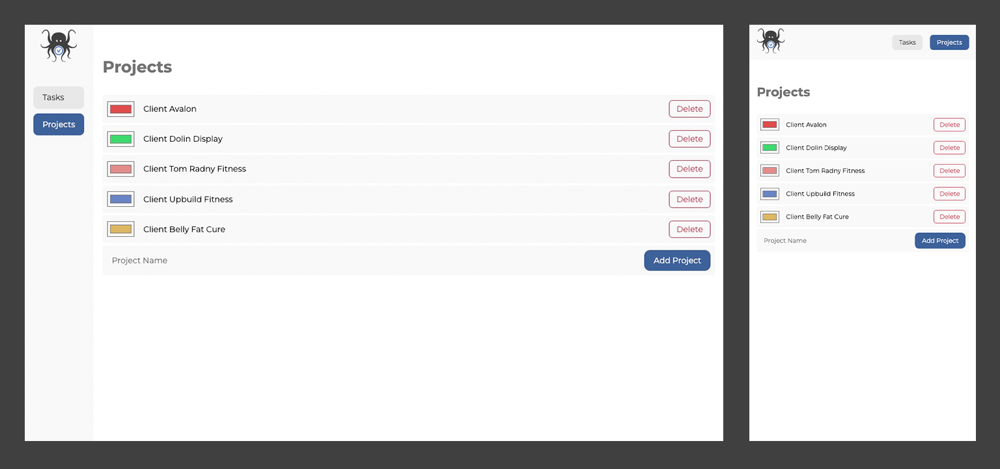
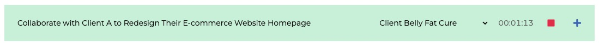

# Octotasker - CI Project 2 v.0.5.6 <!-- omit from toc -->

"Octotasker is my second portfolio project for the Code Institute Diploma in Full-Stack Software Development. This MVP task manager app is meticulously designed to optimize workflow and boost productivity. It allows users to add tasks effortlessly, track the time spent on each task, and organize tasks under specific projects for enhanced clarity. Octotasker stands out with its intuitive interface, making task management straightforward for both personal and professional contexts. In addition to these features, the app offers the convenience of marking tasks as complete and supports the bulk deletion of finished tasks. This keeps the workspace organized and efficient, ensuring users can focus on what matters most. Designed with simplicity and effectiveness in mind, Octotasker is a tool that transforms task management into a seamless and productive experience."

   

[Octotasker Deployed Website](https://patrickhladun.github.io/octotasker/)

## Table of Contents<!-- omit from toc -->

- [Project Scope and Objectives](#project-scope-and-objectives)
  - [Objectives](#objectives)
- [User Experience](#user-experience)
  - [Audience Persona: Emily O'Sullivan](#audience-persona-emily-osullivan)
    - [Demographics:](#demographics)
    - [Psychographics:](#psychographics)
    - [Behavioral Traits:](#behavioral-traits)
    - [Online Habits:](#online-habits)
    - [How Octotasker Meets Emily's Needs:](#how-octotasker-meets-emilys-needs)
  - [User Goals for Octotasker](#user-goals-for-octotasker)
  - [User Stories](#user-stories)
  - [Five Planes of UX for Octotasker](#five-planes-of-ux-for-octotasker)
    - [1. Strategy Plane](#1-strategy-plane)
    - [2. Scope Plane](#2-scope-plane)
    - [3. Structure Plane](#3-structure-plane)
    - [4. Skeleton Plane](#4-skeleton-plane)
    - [5. Surface Plane](#5-surface-plane)
  - [Wireframes](#wireframes)
- [Responsive Pages Overview](#responsive-pages-overview)
  - [Tasks Page](#tasks-page)
  - [Projects Page](#projects-page)
  - [Custom 404 Page](#custom-404-page)
- [Features](#features)
  - [Task Management:](#task-management)
  - [Time Tracking:](#time-tracking)
  - [Task Detail Editing:](#task-detail-editing)
  - [Project Management:](#project-management)
  - [User Interface:](#user-interface)
  - [Data Persistence:](#data-persistence)
  - [Alert System:](#alert-system)
- [Design](#design)
  - [Color Scheme](#color-scheme)
    - [Primary Colors](#primary-colors)
    - [Neutral Tones](#neutral-tones)
    - [Accent Colors](#accent-colors)
  - [Logo](#logo)
  - [404 Image](#404-image)
  - [Typography](#typography)
  - [Icons](#icons)
- [Testing and Validation](#testing-and-validation)
  - [Website Header Navigation](#website-header-navigation)
  - [Tasks Page Testing](#tasks-page-testing)
    - [Adding a task](#adding-a-task)
    - [Task Management Testing](#task-management-testing)
  - [Project page testing](#project-page-testing)
  - [JavaScript Code Validation](#javascript-code-validation)
  - [HTML Validation](#html-validation)
  - [CSS Validation](#css-validation)
- [Page Speed Insights](#page-speed-insights)
  - [Index (Tasks) Page](#index-tasks-page)
  - [Projects Page](#projects-page-1)
  - [404 Error Page](#404-error-page)
- [Technologies Used](#technologies-used)
- [Deployment \& Local Development](#deployment--local-development)
  - [App Deployment](#app-deployment)
  - [Setting Up Local Development](#setting-up-local-development)
- [Issues](#issues)
  - [Unresolved Issues](#unresolved-issues)
- [Future Improvements for Octotasker MVP](#future-improvements-for-octotasker-mvp)
- [Credits](#credits)
- [Acknowledgments](#acknowledgments)

## Project Scope and Objectives

[Back to Top](#table-of-contents)

Octotasker is a straightforward and efficient task management web application designed to cater to everyday needs for personal and professional task tracking. The scope of this project was to create a user-friendly platform that provides essential functionalities to manage tasks efficiently, track time spent on individual tasks, and organize tasks under different projects.

### Objectives

1. **User-Friendly Task Management:** To develop an intuitive interface where users can easily add, manage, and track tasks without a steep learning curve.

2. **Time Tracking for Each Task:** Implement a timer feature to measure the time spent on individual tasks, fostering productivity and effective time management.

3. **Enhanced Task Organization:** Offer the ability to categorize tasks under different projects, allowing users to segregate and prioritize tasks more efficiently.

4. **Responsive Design:** Ensure that the application is accessible and functional across various devices and screen sizes, providing a consistent user experience.

5. **Data Persistence:** Utilize browser local storage to save tasks and projects, ensuring that user data remains intact between sessions.

6. **Performance and Accessibility:** Optimize the web application for performance and accessibility, making it fast and accessible to a broader audience.

7. **Simplicity and Minimalism:** Focus on a minimalist design to prevent user overwhelm, making task management more approachable and less daunting.

The goal of Octotasker is not just to provide a digital checklist but to enhance the overall task management process, making it more structured, time-efficient, and user-centric.

## User Experience

[Back to Top](#table-of-contents)

### Audience Persona: Emily O'Sullivan

#### Demographics:

[Back to Top](#table-of-contents)

- **Age**: 35
- **Gender**: Female
- **Location**: Near Dublin, Ireland
- **Occupation**: Middle-level Manager in a Tech Company
- **Education**: Bachelor's Degree in Business Management
- **Marital Status**: Married with two children

#### Psychographics:

[Back to Top](#table-of-contents)

- **Interests**: Emily enjoys optimizing work processes, loves technology that simplifies life, and seeks tools to balance work and family life.
- **Goals**: Aims to enhance productivity at work and home, efficiently manage her team, and keep track of family-related tasks.
- **Challenges**: Struggles to balance a demanding career with her roles as a mother and wife, often finding it hard to track various tasks and deadlines.

#### Behavioral Traits:

[Back to Top](#table-of-contents)

- **Tech-Savvy**: Comfortable using digital tools and apps for task management.
- **Organizational Needs**: Prefers structured approach in managing professional and personal tasks.
- **Time Management**: Looks for ways to manage time more effectively.

#### Online Habits:

[Back to Top](#table-of-contents)

- **App Usage**: Relies on productivity apps for daily activity organization.
- **Research-Oriented**: Spends time researching best tools for task and project management.
- **Community Engagement**: Participates in forums and groups related to productivity and management.

#### How Octotasker Meets Emily's Needs:

[Back to Top](#table-of-contents)

- **Task Organization**: Allows Emily to categorize and prioritize tasks efficiently.
- **Time Tracking**: Helps monitor time spent on individual tasks, aiding better time management.
- **Project Categorization**: Enables creating different projects for her varied roles and responsibilities.
- **Intuitive Interface**: Easy to navigate and use.
- **Mobile Accessibility**: Manages tasks on-the-go, suitable for her busy lifestyle.

### User Goals for Octotasker

[Back to Top](#table-of-contents)

1. **Efficient Task Management**: Users aim to efficiently manage and organize their daily tasks, ensuring a clear understanding of priorities and deadlines.
2. **Time Tracking**: Users seek to track the amount of time spent on individual tasks, facilitating better time management and productivity.
3. **Project Organization**: The ability to categorize tasks under specific projects, allowing users to separate personal tasks from professional ones and manage them accordingly.
4. **Ease of Use**: A simple and intuitive interface that doesn't require a steep learning curve, making the app accessible to users of all technical skill levels.
5. **Data Persistence**: Users need their tasks and projects to be saved and accessible across sessions, ensuring no loss of data when they return to the app.

### User Stories

[Back to Top](#table-of-contents)

- As a user, I want to add new tasks, so that I can keep track of the things I need to do.
- As a user, I want to set due dates for tasks, so that I can manage my deadlines and ensure timely completion.
- As a user, I want to start and stop a timer for each task, so that I can track the amount of time I spend on each task.
- As a user, I want to edit project details such as the project name and color, so that I can customize and organize projects according to my preferences.
- As a user, I want to view a list of all my projects, so that I can easily access and manage them.
- As a user, I want to delete tasks or projects that are no longer needed, so that I can keep my task list and project board up-to-date.
- As a user, I want to see a visual indication (like a highlight color) for each task, so that I can easily distinguish between different projects.
- As a user, I want a simple and intuitive user interface, so that I can use the application easily without a steep learning curve.

### Five Planes of UX for Octotasker

[Back to Top](#table-of-contents)

#### 1. Strategy Plane

**User Needs:**

- Efficient and easy management of tasks.
- Accurate time tracking for tasks.
- Simple and intuitive user interface.

  **Business Objectives:**

- Provide a user-friendly task management tool.
- Increase user base through intuitive design and functionality.
- Build a foundation for future enhancements like collaboration tools.

#### 2. Scope Plane

**Functional Requirements:**

- Add, edit, and delete tasks.
- Start and stop task timers.
- Categorize tasks under projects.
- View completed and pending tasks.

#### 3. Structure Plane

**Interaction Design:**

- Straightforward navigation between task list, timer, and projects.
- Interactive elements like buttons for adding tasks and toggling timers.

**Information Architecture:**

- Clear categorization of tasks and projects.
- Easy-to-find controls for task and project management.

#### 4. Skeleton Plane

**Interface Design:**

- Clean layout with prominent task and timer sections.
- Visually distinct areas for not-completed and completed tasks.

**Navigation Design:**

- Simple menu for accessing main features.
- Clear labels and icons for intuitive navigation.

**Information Design:**

- Task lists displayed with necessary details like deadlines and time spent.
- Visual cues for overdue tasks or active timers.

#### 5. Surface Plane

**Visual Design:**

- Aesthetic consistency with the Octotasker brand.
- Custom icons and imagery that align with the overall design language.

### Wireframes

**Tasks Page**  **Projects Page** 

## Responsive Pages Overview

Octotasker consists of two main pages: the Task Management page and the Project Management page, as well as a custom 404 error page. I designed all these pages with responsiveness in mind, ensuring they adapt and function seamlessly across various devices, from desktops to tablets and smartphones. This responsive design enhances the user experience, making Octotasker accessible and efficient regardless of the device used. The custom 404 page adds a unique touch, improving user engagement even when they encounter a missing page.

### Tasks Page

### Projects Page

### Custom 404 Page

## Features

[Back to Top](#table-of-contents)

### Task Management:

- Add new tasks with ease.
- Instantly start a timer for new tasks.
- View lists of completed and uncompleted tasks.
- Edit task names directly from the task list.
- Start and stop timers for existing tasks.
- Toggle tasks between completed and uncompleted status.
- Delete individual tasks.
- Bulk delete all completed tasks with a single button.

### Time Tracking:

- Keep track of the time spent on each task with an integrated timer.
- Time tracking continues seamlessly across task switching.

### Task Detail Editing:

- Access a dedicated edit window for each task.
- Update task names, due dates, and detailed descriptions.
- Assign tasks to specific projects from available options.

### Project Management:

- Add new projects to categorize tasks.
- Delete projects.
- Rename projects for better identification.
- Customize project colors for visual distinction.

### User Interface:

- Intuitive and responsive design for both personal and professional use.
- Dynamic updates to the user interface using JavaScript DOM manipulation.

### Data Persistence:

- Tasks and projects are saved in the browser's local storage, ensuring data persistence between sessions.

### Alert System:

- Customizable alerts for various actions like task addition, updates, or deletions.

## Design

### Color Scheme

Choosing the right colors for my app is very important. Colors can affect how users feel and interact with the app. They also help make the app's design clear and easy to use.

#### Primary Colors

I use blue as the main color for action buttons and important parts of the interface. Blue is a trustworthy and reliable color.

#### Neutral Tones

Whites and grays are the colors I choose for backgrounds and inactive elements. They make the app look clean and easy to read.

#### Accent Colors

Red is the color for delete buttons and alerts. It grabs attention and signals caution. Green is for success messages and completed tasks. It gives a feeling of accomplishment and positivity.

### Logo

The custom-designed logo features an octopus holding a timer, symbolizing the app's multifaceted task management capabilities and efficient time tracking.

### 404 Image

For the 404 error page, a fun and engaging image of an octopus is generated using DALL-E, adding a unique and playful touch to the app.

### Typography

The app uses the Montserrat font, known for its clean lines and modern feel. This sans-serif typeface offers excellent readability and a contemporary aesthetic, aligning well with the app's minimalist design philosophy.

 

### Icons

Custom icons created in Illustrator adorn the app, lending a unique and cohesive look. These simple yet effective icons are designed for clarity and ease of use, enhancing the overall user experience.

## Testing and Validation

I've thoroughly tested task management and project features by hand. I made sure that adding, updating, and deleting tasks and projects works perfectly. I tried every button and link to check they do what they should. I also checked that the time tracking for tasks is accurate. I used different browsers and devices to test. This makes sure the app is reliable and easy to use for everyone.

### Website Header Navigation

[Back to Top](#table-of-contents)

| Test scenario | Steps to Reproduce | Observation | Outcome |
| --- | --- | --- | --- |
|  |  |  |  |
| Tasks menu link | Click on the 'Tasks' menu link. | The 'Tasks' menu link should navigate the user to the tasks page. | Navigates to tasks page as expected. |
| Projects menu link | Click on the 'Projects' menu link. | The 'Projects' menu link should navigate the user to the projects page. | Navigates to projects page as expected. |
| Logo link | Click on the website logo. | The logo link should navigate the user to the main page, which is the tasks page. | Navigates to the main tasks page as expected. |

### Tasks Page Testing

#### Adding a task

[Back to Top](#table-of-contents)

| Test scenario | Steps to Reproduce | Observation | Outcome |
| --- | --- | --- | --- |
|  |  |  |  |
| Add task by adding task title and pressing enter | Add task name and press enter on the keyboard. | The task should be added to the tasks list. | The task is added as expected. |
| Add task by pressing Plus icon | Add task name and click on plus icon. | The task should be added to the tasks list. | The task is added as expected. |
| Add task and start the timer | Add task name and press Start icon. | The task should be added to the tasks list and the task timer should start immediately. | The task is added as expected and timer is started. |
| Add the task with selecting the project | Add task name and select the project from the list and press enter, click start or plus button to add the task. | The task should be added and if the start buttons would be clicked task timer also should be started. | The task is added with the project and also task time started when start have been clicked. |
| Try to add task without providing task title | Press enter, click on Start or Plus button to try to add the task without providing name. | The task should not be added and alert should be displayed. | The task was not added and alert was displayed to inform that the task can't be added without the name. |

#### Task Management Testing

| Test scenario | Steps to Reproduce | Observation | Outcome |
| --- | --- | --- | --- |
|  |  |  |  |
| Stating task timer | Click on the task timer start button for selected task | The task timer should start running, the start button should change to stop button, the top task section should update with the running task name, project name, the task time should also run and stop button be present. Also, the task top section should highlight with light green and the background should fade away and notification should appear on the bottom of the screen. | All items from observation were fulfilled. |
| Stoping task timer | Click on the task timer stop button on the task itself or on the top section. | The task timer should stop. On the task, the timer should display elapsed time for the task. Stop Buttons should change to start button. The top section should reset to the default state and be ready to add a new task. Then notification should appear confirming the task timer is stopped. | All items from observation were fulfilled. |
| Update task name on the task lists. | Click on the selected task name and change the name of the task. Press enter or click away to save the changes. | The task name should update when clicking away or pressing enter. The notification should appear confirming the update. | The task name was changed, and the notification appeared confirming the update. |
| Complete the task | Click on the complete the task icon. | The task should be moved to Completed section. The task complete button should change to green, and the title, time, and start button should grey out to indicate they are inactive. If the task was running, the timer should be stopped. | All items from observation were fulfilled. |
| Uncheck the completed task | Click on the green completed icon. | The task should be moved back to the tasks section, the complete icon should be greyed out, and name, time, and start icons should return to a normal state. | All items from observation were fulfilled. |
| Clear completed tasks | Click on Clear Completed Tasks button | When the button is clicked, all completed tasks should be deleted, and a notification should appear confirming the tasks were cleared. | All items from observation were fulfilled. |
| Delete the task | Click on the three-dot icon, then on the delete button. | By clicking on the three dots button, options are displayed with a delete button and edit button. When the delete button is clicked, the task should be deleted, and a notification should appear confirming the action. | All items from observation were fulfilled. |
| Open edit window | Click on the three dots button, then on the edit button. | By clicking on the edit button, a window should appear with the task details. | The edit window successfully opened. |
| Update task details | Change the task details of task title, date, details, or project, and click save. | The task details should be saved, and a notification should appear confirming the update. | All items from observation were fulfilled. |
| Close edit window | Click on the close button. | Edit window should close. | Edit window successfully closed. |

### Project page testing

| Test scenario | Steps to Reproduce | Observation | Outcome |
| --- | --- | --- | --- |
|  |  |  |  |
| Add new project | Type project name and press enter or click on Add project button | The Project should be added to the list | The project was added to the list |
| Change the project name | Click on the project name and change the text. Click away or press enter to update the project name. | The project name should be saved, and the notification should appear confirming the change. | The project name was successfully changed. |
| Change the project color | Click on the color picker to select the colour. Click away to save the changes | The color should update, and a notification should appear. | The project color was successfully changed. |
| Project color on the task item | Change project color to be different from the default white colour. Navigate to the task page and assign the project to any of the active tasks. The project color should appear as a dot just before the task name. | When the project is added to the task, the dot shows the project color. | Project color successfully displayed. |

### JavaScript Code Validation

[Back to Top](#table-of-contents)

I used JSHint online tool for validating the JavaScript code of Octotasker. My code passed the validation with no errors. This ensures that the JavaScript in Octotasker adheres to standard coding practices, contributing to its overall reliability and performance.

### HTML Validation

[Back to Top](#table-of-contents)

I conducted HTML validation using the W3C Markup Validation Service for all the pages of the app. There were no errors or warnings found on any of the pages.

- [Index (Tasks) Page](https://validator.w3.org/nu/?doc=https%3A%2F%2Fpatrickhladun.github.io%2Foctotasker%2Findex.html)
- [Projects Page](https://validator.w3.org/nu/?doc=https%3A%2F%2Fpatrickhladun.github.io%2Foctotasker%2Fprojects.html)
- [404 Page](https://validator.w3.org/nu/?doc=https%3A%2F%2Fpatrickhladun.github.io%2Foctotasker%2F404.html)

### CSS Validation

[Back to Top](#table-of-contents)

I validated Octotasker's CSS using the W3C CSS Validation Service. This ensured the CSS met web standards and best practices. The CSS passed without any issues, confirming the app's well-structured and compliant styling.

[W3C CSS Validation Results](https://jigsaw.w3.org/css-validator/validator?uri=https%3A%2F%2Fpatrickhladun.github.io%2Foctotasker%2F&profile=css3svg&usermedium=all&warning=1&vextwarning=&lang=en)

## Page Speed Insights

I tested the app for performance, accessibility, best practices, and SEO using Google's Page Speed Insights. By following its recommendations, I optimized the website to ensure quick loading times, high accessibility standards, adherence to web best practices, and effective SEO.

### [Index (Tasks) Page](https://pagespeed.web.dev/analysis/https-patrickhladun-github-io-octotasker-index-html/1ley1ojq1a?form_factor=mobile)

### [Projects Page](https://pagespeed.web.dev/analysis/https-patrickhladun-github-io-octotasker-projects-html/mbe9e41t1p?form_factor=mobile)

### [404 Error Page](https://pagespeed.web.dev/analysis/https-patrickhladun-github-io-octotasker-404-html/sh3bo84bdj?form_factor=mobile)

## Technologies Used

In developing Octotasker, I have used a range of technologies to ensure efficient performance and a user-friendly experience. Here's an overview of the main technologies used:

- HTML5: For structuring the content of the web application.
- CSS3: Used for styling the content and ensuring responsive design across different devices.
- JavaScript (ES6): For creating interactive elements and managing the application's logic, such as task and project management functionalities.
- Local Storage: To persist data like tasks and projects, ensuring that user data remains intact between sessions.
- GitHub Pages: For hosting the application, allowing easy access and seamless updates.
- Visual Studio Code with Live Server Plugin: Utilized during development for real-time page reloading and efficient coding.
- Google PageSpeed Insights: Used for testing the performance, accessibility, best practices, and SEO of the web pages.
- CSS Validator: To ensure that the CSS code adheres to the standards and is free from errors.

## Deployment & Local Development

In this section, I outline how I've deployed Octotasker to GitHub Pages and how you can set up a similar environment using the Live Server extension in Visual Studio Code for local development.

### App Deployment

My app, Octotasker, is currently hosted and live on GitHub Pages. Here's how I managed the deployment:

1. **Repository Configuration:** I have set up my project's GitHub repository to automatically deploy from the `main` branch to GitHub Pages.

2. **Push to Deploy:** Every time I push new changes to the `main` branch, GitHub Pages automatically deploys the new version, making it immediately available online.

3. **Accessing the Live App:** You can visit the live app here: [Octotasker](https://patrickhladun.github.io/octotasker/).

### Setting Up Local Development

For local development, here's how I proceed:

1. **Clone the Repository:** I clone my repository using `git clone https://github.com/my-username/octotasker.git` to get a local copy of the project on my machine.

2. **Using Visual Studio Code:** I open the project folder in Visual Studio Code to start making changes.

3. **Starting Live Server:** With the Live Server VSCode extension, I right-click on the `index.html` file and choose 'Open with Live Server' to run the app locally.

4. **Local Server Access:** The app then opens in my default web browser, or I navigate to `http://127.0.0.1:5500` to view the app.

This local development process allows me to develop and test new features in isolation. Only when I'm satisfied with the changes do I push them to the live site.

_Note: Make sure to replace `https://github.com/my-username/octotasker.git` with the actual URL of your own GitHub repository if you're setting this up for yourself._

## Issues

[Back to Top](#table-of-contents)

### Unresolved Issues

- [Issue #1 - Missing highlight when switching timer tracking between tasks](https://github.com/patrickhladun/octotasker/issues/1)
- [Issue #2 - Task time stop button not changing](https://github.com/patrickhladun/octotasker/issues/2)
- [Issue #3 - Low contrast issue with completed task text](https://github.com/patrickhladun/octotasker/issues/3)

## Future Improvements for Octotasker MVP

[Back to Top](#table-of-contents)

1. Project Details Enhancement: In future updates, I plan to incorporate more detailed information for each project. This could include descriptions or notes associated with a project, giving users a better understanding of the project's scope and objectives.

2. Enhanced Project Stats View: A significant improvement would be the addition of a statistics section for each project. This feature would allow users to view essential stats related to a project, such as the number of tasks, the number of completed tasks, and the total time spent on all tasks within that project. This enhancement aims to provide users with a comprehensive overview of their project progress and time allocation.

3. Time Tracking and Analytics: Expanding on the time tracking capabilities, I intend to add a feature that shows weekly time spent on tasks, alongside other time-related statistics. This would offer users insights into their productivity patterns and help them make informed decisions about managing their time more effectively.

## Credits

[Back to Top](#table-of-contents)

- Used part of normalize.css v8.0.1 by [Nicolas Gallagher](github.com/necolas/normalize.css)
- Safari browser mockup by [sashalazar](https://sashalazar.gumroad.com/l/mqxFJ)
- Mobile Phone Mockup by [Antony Boyd](https://www.anthonyboyd.graphics/mockups/iphone-14-pro-max-mockup/)

## Acknowledgments

[Back to Top](#table-of-contents)
